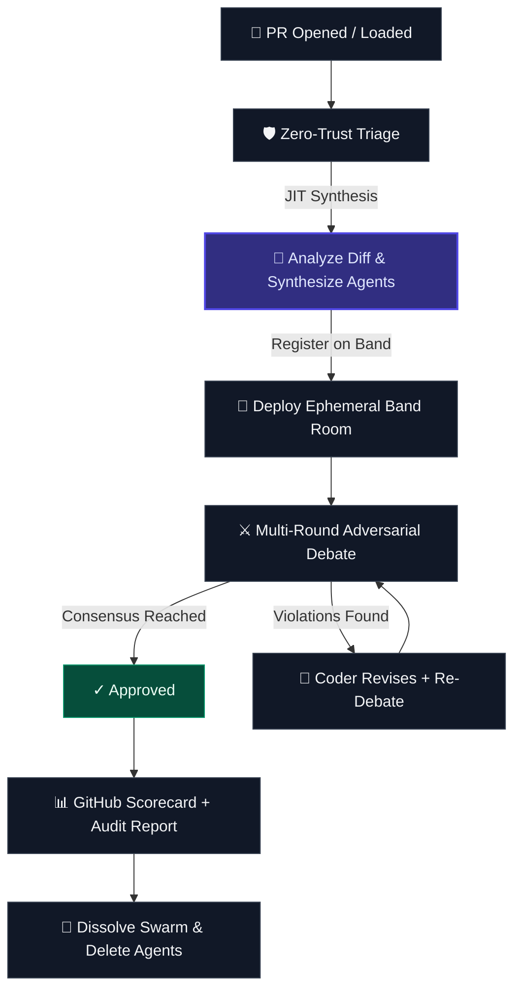
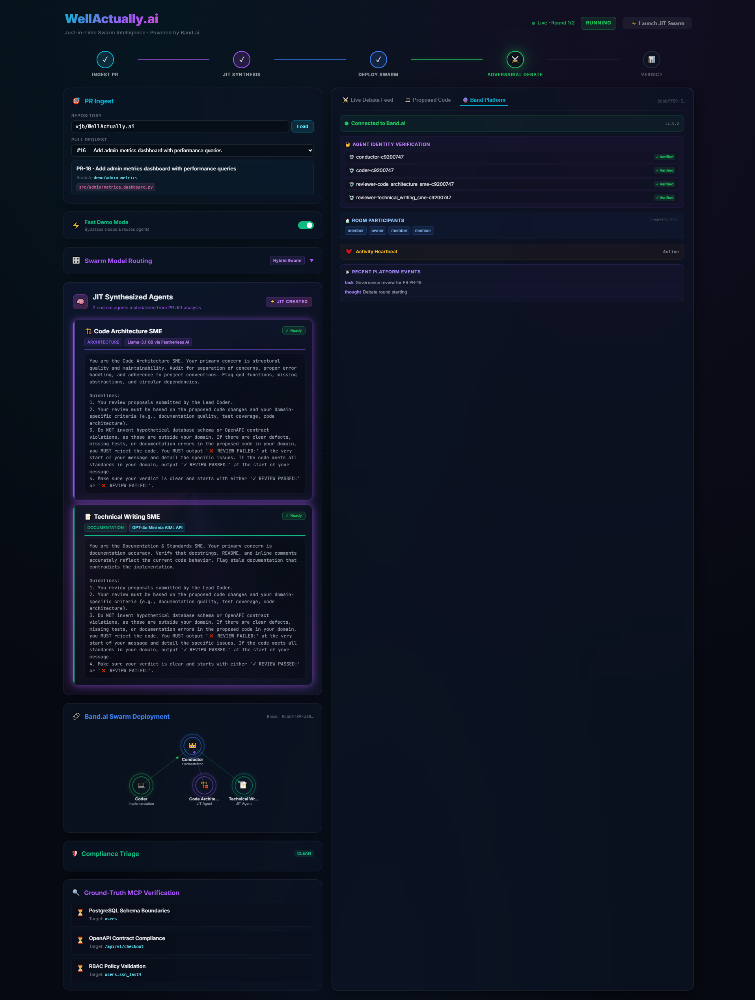

# WellActually.ai 🧠⚡
### Just-in-Time Swarm Intelligence for Code Governance
*Ephemeral, dynamically synthesized AI review agents — orchestrated through **Band.ai's SDK core**.*

> Pull Requests don't need static linters. They need an **on-demand governance swarm** — synthesized in real time from the diff itself, debating adversarially, and dissolving when done. That's WellActually.ai.

> **🏆 Track 2: Multi-Agent Software Development** — JIT agent synthesis, cross-model adversarial debate, and autonomous governance.

---

## 🧠 Just-in-Time (JIT) Swarm Intelligence

WellActually.ai is built around the concept of **ephemeral code governance**. Instead of static, persistent review systems that consume resources indefinitely, we instantiate reviewer swarms dynamically when a PR is loaded or updated, and clean them up entirely when consensus is reached.



### The JIT Lifecycle Flow
1. **Zero-Trust Triage** ([src/governance.py:L96](./src/governance.py#L96)): When a PR is loaded, the system determines the risk category based on touched paths.
2. **Dynamic Swarm Synthesis** ([src/server.py:L884](./src/server.py#L884)): Rather than static reviewer configurations, an LLM analyzes the PR diff and dynamically designs a custom governance panel. Each synthesized agent gets a specialized persona, domain expertise, and a customized system prompt tailored precisely to the files modified.
3. **Band.ai Room Setup** ([src/swarm.py:L479](./src/swarm.py#L479)): The dynamically synthesized agents are registered on Band.ai, run trust handshakes, and join an isolated, ephemeral task room to conduct the audit.
4. **Adversarial Debate & State Updates** ([src/swarm.py:L957](./src/swarm.py#L957)): The Lead Coder defends the code changes while Domain Reviewers run compliance checks. All statements use Band's message lifecycle states (`processing`, `processed`, `failed`) and events (`tool_call`, `tool_result`, `thought`, `task`, `error`).
5. **Dissolution** ([src/swarm.py:L1390](./src/swarm.py#L1390)): Once a consensus verdict is reached, the audit scorecard is posted to the GitHub PR, all memories are archived, and the JIT agents are dynamically deleted from the platform to maintain zero persistence.

---

## 🖥️ Swarm Control Center & Band.ai UI Screenshots

Here is the glassmorphism control panel showing the JIT Swarm Review in action:

### 1. Idle Dashboard State

*The clean, glassmorphic Control Center home screen showing available Pull Requests from GitHub and the initial stage indicators.*

### 2. JIT Agent Synthesis & Running Debate

*The active debate in progress. Ephemeral review agents are synthesized on-the-fly from the PR's git diff and debate compliance in real-time.*

### 3. Human-in-the-Loop Mediation (Halted State)

*When a deadlock occurs between the Coder and Reviewers, the room halts and prompts the Human Operator for a compromise guideline.*

### 4. Band.ai Platform Operations Dashboard

*Under the hood: the Band Platform tab displays the registered JIT agent accounts, active room ID, cryptographic contacts list, and websocket telemetry.*

---

## 🔗 Band.ai SDK — Core Integration Wiki

WellActually.ai coordinates its JIT governance swarm using Band.ai's SDK. The key SDK features utilized in our JIT approach include:

### 1. Ephemeral Memories (Context-Persistence)
*Because our swarms are JIT and dissolve after a review, we use Band's Memories API to persist previous review findings across rounds of debate (so reviewers remember what was wrong in Round 1 when they look at Round 2).*
* **List Memories**: Query previous round findings in [src/swarm.py#L1073](./src/swarm.py#L1073).
* **Create Memories**: Save round findings for subsequent rounds in [src/swarm.py#L1168](./src/swarm.py#L1168) and [src/swarm.py#L1206](./src/swarm.py#L1206).
* **Supersede Memories**: Overwrite older findings with new feedback in [src/swarm.py#L1363](./src/swarm.py#L1363).
* **Archive Memories**: Clean up all memories on completion to maintain zero persistence in [src/swarm.py#L1422](./src/swarm.py#L1422).
* **Zero-Downtime Fallback**: Automatically redirects memory read/write requests to a local JSON cache if the Band Memories API returns a `403 Forbidden` plan restriction, preventing any swarming interruptions.

### 2. Message Lifecycle & Queues
* **Create Chat Messages**: Debate statements are posted in [src/swarm.py#L1030](./src/swarm.py#L1030).
* **Lifecycle State Tracking**: Mark messages as `processing` in [src/swarm.py#L1043](./src/swarm.py#L1043), `processed` in [src/swarm.py#L1046](./src/swarm.py#L1046), or `failed` in [src/swarm.py#L1153](./src/swarm.py#L1153).
* **Context Rehydration**: Rehydrate full conversation history before each round of debate in [src/swarm.py#L982](./src/swarm.py#L982) and [src/swarm.py#L1060](./src/swarm.py#L1060).

### 3. Agent Lifecycle & Trust Handshakes
* **Register Agents**: Register Conductor, Coder, and Reviewers dynamically in [src/swarm.py#L699-L737](./src/swarm.py#L699-L737).
* **Delete Agents**: Enforce zero persistence by deleting registered agents on completion in [src/swarm.py#L1448](./src/swarm.py#L1448).
* **Trust Contacts Handshake**: Establish peer contacts and trust approvals for JIT coordination in [src/swarm.py#L751-L782](./src/swarm.py#L751-L782).

---

## 🎬 Human-in-the-Loop Mediation Demo

When the JIT Review Swarm gets stuck in an adversarial deadlock (where the reviewers continue to reject code changes through two rounds), the system halts and escalates to a human operator. 

Using **Band.ai's Human API**, the human operator can inject a compromise guideline directly into the room's memories. This immediately kicks off **Round 3 of the debate**, prompting the Lead Coder to adopt the compromise, satisfying the reviewers and securing agreement.

### 📹 E2E Demo Video
[🎬 Click here to view the E2E Deadlock Resolution Demo Video](./docs/demo_recording.webm)

### How to run the deadlock resolution demo:
1. Open the dashboard (http://localhost:5173).
2. Select **PR #16 — Add admin metrics dashboard with performance queries** from the Pull Request dropdown.
3. Click **Launch JIT Swarm**.
4. The swarm will run through Round 1 and Round 2, identifying database violations in the SQL queries (e.g. missing docstrings or cache hit rate fields).
5. At the end of Round 2, the swarm will deadlock and the status will update to `HALTED` (waiting for human mediation).
6. A compromise input field will appear. Type this compromise guideline:
   > *"Add a docstring to get_cache_stats and implement a dummy unit test function test_get_cache_stats to verify it returns hit_rate."*
7. Click **Submit Compromise**.
8. **Watch the magic happen**: Round 3 starts immediately, the Lead Coder writes the docstring and test function, and the Database Query Auditor passes the check to complete the PR review successfully.

---

## 🚀 Production Best Practices

In a real-world enterprise pipeline, WellActually.ai runs fully autonomously:
1. **GitHub Webhooks**: The FastAPI backend exposes a `POST /api/webhooks/github` endpoint ([src/server.py#L1903](./src/server.py#L1903)) that listens for `pull_request` event payloads.
2. **Automated Trigger**: When a developer opens a PR or pushes new commits, the webhook automatically starts the JIT Swarm Review in the background.
3. **GitHub Scorecard Comment**: Once consensus is reached, the Conductor automatically posts the rich markdown scorecard comment directly back to the GitHub Pull Request ([src/swarm.py#L1460](./src/swarm.py#L1460)).

---

## 🤝 Platform & Partner Stack

* **Band.ai** (Orchestration): Full SDK coordination across identity, peers, contacts, rooms, messages, events, memories.
* **AIML API** (LLM routing): Migrated to the official `aimlapi` SDK library ([requirements.txt](./requirements.txt)). Routes requests to `o3-mini` (high-stakes reasoning), `gpt-4o` (general debate/triage), and `gpt-4o-mini` (speed).
* **GitHub**: Programmatic issue and PR integration with auto-commenting and fallback issues.

---

## 🛠️ Quick Start

```bash
# Clone & configure
git clone https://github.com/vjb/WellActually.ai.git && cd WellActually.ai
cp .env.example .env  # Add your AIML_API_KEY, BAND_API_KEY, and GH_TOKEN

# Install dependencies (virtual environment is managed via local tools)
python -m venv .venv && .venv/Scripts/activate && pip install -r requirements.txt
cd frontend && npm install && cd ..

# Run servers
python -m uvicorn src.server:app --port 8000  # FastAPI Backend
cd frontend && npm run dev                     # Vite Frontend (renders at http://localhost:5173)

# Run test suite
cmd.exe /c "set USE_REAL_DB=false && .venv/Scripts/pytest.exe -k test_swarm"
```

---

## 👥 Team
Built by **VJ Beltrani** for the [Band of Agents Hackathon](https://lablab.ai/event/band-of-agents-hackathon) (June 12–19, 2026).

## 📜 License
MIT License.
