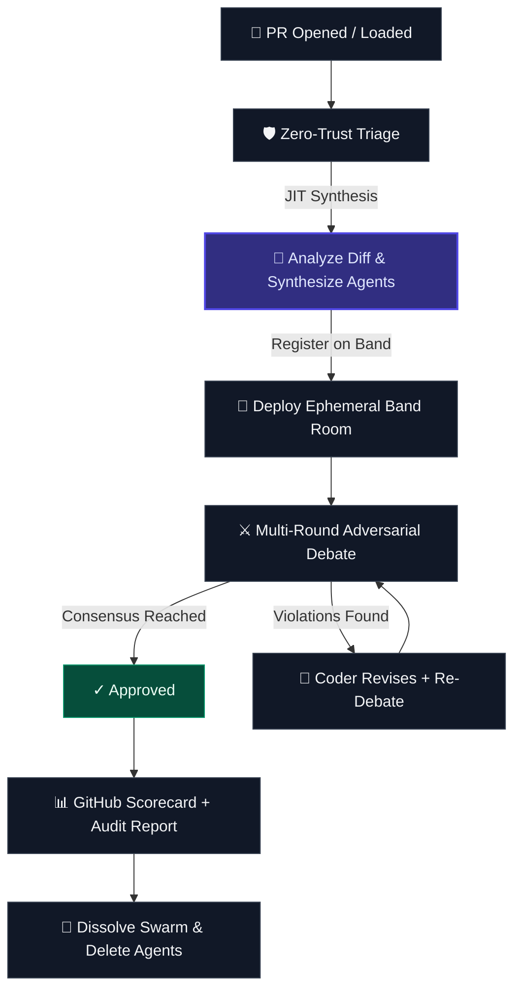
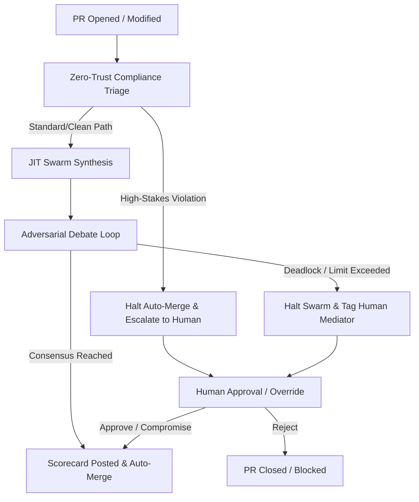

# WellActually.ai 🧠⚡
### Just-in-Time Swarm Intelligence for Code Governance
*Ephemeral, dynamically synthesized AI review agents — orchestrated through **Band.ai's full SDK surface**.*

> Pull Requests don't need static linters. They need an **on-demand governance swarm** — synthesized in real time from the diff itself, debating adversarially, and dissolving when done. That's WellActually.ai.

> **🏆 Track 2: Multi-Agent Software Development** — JIT agent synthesis, cross-model adversarial debate, and autonomous governance.

---

## 🎬 Demo Video

> *Coming soon — demo video will be added before submission.*

---

## 🧠 Just-in-Time (JIT) Swarm Intelligence

WellActually.ai is built around the concept of **ephemeral code governance**. Instead of static, persistent review systems that consume resources indefinitely, we instantiate reviewer swarms dynamically when a PR is loaded or updated, and clean them up entirely when consensus is reached.



### The JIT Lifecycle Flow
1. **Zero-Trust Triage** ([src/governance.py:triage_pr](file:///c:/Users/vjbel/hacks/BOA/src/governance.py#L33-L52)): When a PR is loaded, the system determines the risk category based on touched paths.
2. **Dynamic Swarm Synthesis** ([src/server.py:analyze_pr_for_swarm](file:///c:/Users/vjbel/hacks/BOA/src/server.py#L254-L310)): Rather than static reviewer configurations, an LLM analyzes the PR diff and dynamically designs a custom governance panel. Each synthesized agent gets a specialized persona, domain expertise, and a customized system prompt tailored precisely to the files modified.
3. **Band.ai Room Setup** ([src/swarm.py:initialize_session](file:///c:/Users/vjbel/hacks/BOA/src/swarm.py#L480-L612)): The dynamically synthesized agents are registered on Band.ai, run trust handshakes, and join an isolated, ephemeral task room to conduct the audit.
4. **Adversarial Debate & State Updates** ([src/swarm.py:run_debate_round](file:///c:/Users/vjbel/hacks/BOA/src/swarm.py#L1015-L1160)): The Lead Coder defends the code changes while Domain Reviewers run MCP database and API contract checks. All statements use Band's message lifecycle states (`processing`, `processed`, `failed`) and events (`tool_call`, `tool_result`, `thought`, `task`, `error`).
5. **Dissolution** ([src/swarm.py:cleanup_agents](file:///c:/Users/vjbel/hacks/BOA/src/swarm.py#L1390-L1459)): Once a consensus verdict is reached, the audit scorecard is posted to the GitHub PR, all memories are archived, and the JIT agents are dynamically deleted from the platform to maintain zero persistence.

---

## 🔗 Band.ai SDK — Deep Integration Wiki (40 Methods)

WellActually.ai utilizes **40 unique Band SDK methods** to coordinate its JIT governance swarm. Every method links directly to its implementation below:

### 1. Platform & Health
* **`get_version()`**: Queries the platform version. Linked in [src/swarm.py:492](file:///c:/Users/vjbel/hacks/BOA/src/swarm.py#L492).
* **`health_check()`**: Checks platform operational status. Linked in [src/swarm.py:503](file:///c:/Users/vjbel/hacks/BOA/src/swarm.py#L503).
* **`test.authentication()`**: Validates API authentication. Linked in [src/swarm.py:800](file:///c:/Users/vjbel/hacks/BOA/src/swarm.py#L800).

### 2. Human Profile & Contacts
* **`get_my_profile()`**: Fetches operator profile. Linked in [src/swarm.py:512](file:///c:/Users/vjbel/hacks/BOA/src/swarm.py#L512).
* **`update_my_profile()`**: Sets operator details. Linked in [src/swarm.py:524](file:///c:/Users/vjbel/hacks/BOA/src/swarm.py#L524).
* **`list_my_peers()`**: Discovers operator network. Linked in [src/swarm.py:536](file:///c:/Users/vjbel/hacks/BOA/src/swarm.py#L536).
* **`list_my_contacts()`**: Retrieves user contacts. Linked in [src/swarm.py:545](file:///c:/Users/vjbel/hacks/BOA/src/swarm.py#L545).
* **`list_my_chats()`**: Fetches user-active chats. Linked in [src/swarm.py:553](file:///c:/Users/vjbel/hacks/BOA/src/swarm.py#L553).
* **`list_my_chat_participants()`**: Lists chat participants. Linked in [src/swarm.py:906](file:///c:/Users/vjbel/hacks/BOA/src/swarm.py#L906).
* **`list_my_chat_messages()`**: Fetches room message list. Linked in [src/swarm.py:914](file:///c:/Users/vjbel/hacks/BOA/src/swarm.py#L914).

### 3. Human Memories API (Gating & Escalation)
* **`list_user_memories()`**: Enumerates user memories. Linked in [src/swarm.py:564](file:///c:/Users/vjbel/hacks/BOA/src/swarm.py#L564) and [src/server.py:2384](file:///c:/Users/vjbel/hacks/BOA/src/server.py#L2384).
* **`create_user_memory()`**: Stores operator guidelines on compromise. Linked in [src/server.py:1453](file:///c:/Users/vjbel/hacks/BOA/src/server.py#L1453) and [src/server.py:1536](file:///c:/Users/vjbel/hacks/BOA/src/server.py#L1536).
* **`archive_user_memory()`**: Clears user memories. Linked in [src/server.py:2411](file:///c:/Users/vjbel/hacks/BOA/src/server.py#L2411).

### 4. Agent Lifecycle & Trust Handshake
* **`register_my_agent()`**: registers new JIT agents. Linked in [src/swarm.py:699, 715, 732](file:///c:/Users/vjbel/hacks/BOA/src/swarm.py#L699-L737).
* **`list_my_agents()`**: Enumerate existing agents. Linked in [src/swarm.py:618](file:///c:/Users/vjbel/hacks/BOA/src/swarm.py#L618).
* **`delete_my_agent()`**: Deletes JIT agents on dissolution. Linked in [src/swarm.py:628](file:///c:/Users/vjbel/hacks/BOA/src/swarm.py#L628) and [src/swarm.py:1448](file:///c:/Users/vjbel/hacks/BOA/src/swarm.py#L1448).
* **`get_agent_me()`**: Post-creation validation. Linked in [src/swarm.py:707, 723, 740](file:///c:/Users/vjbel/hacks/BOA/src/swarm.py#L707-L745).
* **`list_agent_peers()`**: Finds available peer bots. Linked in [src/swarm.py:809](file:///c:/Users/vjbel/hacks/BOA/src/swarm.py#L809).
* **`add_agent_contact()`**: Establishes JIT trust connections. Linked in [src/swarm.py:751, 760, 767, 779](file:///c:/Users/vjbel/hacks/BOA/src/swarm.py#L751-L782).
* **`respond_to_agent_contact_request()`**: Accepts contact trust. Linked in [src/swarm.py:752, 761, 768, 780](file:///c:/Users/vjbel/hacks/BOA/src/swarm.py#L751-L782).
* **`list_agent_contacts()`**: Lists approved trust connections. Linked in [src/swarm.py:788](file:///c:/Users/vjbel/hacks/BOA/src/swarm.py#L788).

### 5. Chat Rooms & Participants
* **`create_agent_chat()`**: Spawns isolated review rooms. Linked in [src/swarm.py:819](file:///c:/Users/vjbel/hacks/BOA/src/swarm.py#L819).
* **`list_agent_chats()`**: Enumerates chats. Linked in [src/swarm.py:606](file:///c:/Users/vjbel/hacks/BOA/src/swarm.py#L606) and [src/swarm.py:830](file:///c:/Users/vjbel/hacks/BOA/src/swarm.py#L830).
* **`get_agent_chat()`**: Fetches room details. Linked in [src/swarm.py:856](file:///c:/Users/vjbel/hacks/BOA/src/swarm.py#L856).
* **`add_agent_chat_participant()`**: Joins JIT agents to the room. Linked in [src/swarm.py:864, 874, 885](file:///c:/Users/vjbel/hacks/BOA/src/swarm.py#L864-L888).
* **`list_agent_chat_participants()`**: Verifies room roster. Linked in [src/swarm.py:894](file:///c:/Users/vjbel/hacks/BOA/src/swarm.py#L894).
* **`remove_agent_chat_participant()`**: Removes participant. Linked in [src/swarm.py:1436](file:///c:/Users/vjbel/hacks/BOA/src/swarm.py#L1436).

### 6. Messages & Lifecycle
* **`create_agent_chat_message()`**: Publishes debate content. Linked in [src/swarm.py:1030, 1139, 1300](file:///c:/Users/vjbel/hacks/BOA/src/swarm.py#L1030).
* **`list_agent_messages()`**: Lists messages for audit trail. Linked in [src/swarm.py:1337](file:///c:/Users/vjbel/hacks/BOA/src/swarm.py#L1337).
* **`get_agent_next_message()`**: Pulls next message from queue. Linked in [src/swarm.py:1346](file:///c:/Users/vjbel/hacks/BOA/src/swarm.py#L1346).
* **`mark_agent_message_processing()`**: Starts execution trace. Linked in [src/swarm.py:1043](file:///c:/Users/vjbel/hacks/BOA/src/swarm.py#L1043) and [src/swarm.py:1151](file:///c:/Users/vjbel/hacks/BOA/src/swarm.py#L1151).
* **`mark_agent_message_processed()`**: Ends successful trace. Linked in [src/swarm.py:1046](file:///c:/Users/vjbel/hacks/BOA/src/swarm.py#L1046) and [src/swarm.py:1156](file:///c:/Users/vjbel/hacks/BOA/src/swarm.py#L1156).
* **`mark_agent_message_failed()`**: Records trace failure. Linked in [src/swarm.py:1153](file:///c:/Users/vjbel/hacks/BOA/src/swarm.py#L1153).

### 7. Rehydration & Event Telemetry
* **`get_agent_chat_context()`**: Rehydrates full chat history. Linked in [src/swarm.py:982](file:///c:/Users/vjbel/hacks/BOA/src/swarm.py#L982) and [src/swarm.py:1060](file:///c:/Users/vjbel/hacks/BOA/src/swarm.py#L1060).
* **`create_agent_chat_event()`**: Emits structured events (`thought`, `task`, `tool_call`, `tool_result`, `error`). Linked in [src/swarm.py:922, 967, 1096, 1125, 1274, 1316, 1404](file:///c:/Users/vjbel/hacks/BOA/src/swarm.py#L922).

### 8. Agent Memories API
* **`create_agent_memory()`**: Saves findings for next rounds. Linked in [src/swarm.py:1168](file:///c:/Users/vjbel/hacks/BOA/src/swarm.py#L1168) and [src/swarm.py:1206](file:///c:/Users/vjbel/hacks/BOA/src/swarm.py#L1206).
* **`get_agent_memory()`**: Fetches memory details. Linked in [src/swarm.py:1187](file:///c:/Users/vjbel/hacks/BOA/src/swarm.py#L1187).
* **`list_agent_memories()`**: Enumerates previous round findings. Linked in [src/swarm.py:1073](file:///c:/Users/vjbel/hacks/BOA/src/swarm.py#L1073).
* **`supersede_agent_memory()`**: Replaces outdated findings. Linked in [src/swarm.py:1363](file:///c:/Users/vjbel/hacks/BOA/src/swarm.py#L1363).
* **`archive_agent_memory()`**: Clears memories on completion. Linked in [src/swarm.py:1422](file:///c:/Users/vjbel/hacks/BOA/src/swarm.py#L1422).

---

## 🔄 Automated Consensus Flow



---

## 🤝 Platform & Partner Stack

* **Band.ai** (Orchestration): Full SDK coordination across identity, peers, contacts, rooms, messages, events, memories.
* **AIML API** (LLM routing): Migrated to the official `aimlapi` SDK library ([requirements.txt](file:///c:/Users/vjbel/hacks/BOA/requirements.txt)). Routes requests to `o3-mini` (high-stakes reasoning), `gpt-4o` (general debate/triage), and `gpt-4o-mini` (speed).
* **GitHub**: Programmatic issue and PR integration with auto-commenting and fallback issues.

---

## 🛠️ Quick Start

```bash
# Clone & configure
git clone https://github.com/vjb/WellActually.ai.git && cd WellActually.ai
cp .env.example .env  # Add your AIML_API_KEY, BAND_API_KEY, and GH_TOKEN

# Install dependencies (virtual environment is managed via local tools)
python -m venv .venv && .venv/Scripts/activate && pip install -r requirements.txt
cd frontend && npm install && cd ..

# Run servers
python -m uvicorn src.server:app --port 8000  # FastAPI Backend
cd frontend && npm run dev                     # Vite Frontend (renders at http://localhost:5173)

# Run test suite
cmd.exe /c "set USE_REAL_DB=false && .venv/Scripts/pytest.exe -k test_swarm"
```

---

## 👥 Team
Built by **VJ Beltrani** for the [Band of Agents Hackathon](https://lablab.ai/event/band-of-agents-hackathon) (June 12–19, 2026).

## 📜 License
MIT License.
