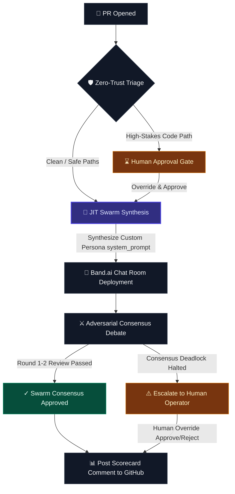

# WellActually.ai 🧠⚡
### Just-in-Time Swarm Intelligence for Code Governance
*Ephemeral, dynamically synthesized AI review agents — powered by **Band.ai**, **Featherless AI** & **AIML API**.*

> **🏆 Track 2: Multi-Agent Software Development** — JIT agent synthesis, cross-model adversarial debate, and human-in-the-loop governance.

---

## 🎬 Demo Video

> *Coming soon — demo video will be added before submission.*

---

## 🚀 The Big Idea

Every code review tool today uses **static agents** — the same reviewers, the same checks, every time. WellActually.ai inverts this entirely:

> **Governance is not a static rulebook. It's ephemeral, dynamically generated compute.**

When a Pull Request arrives, WellActually.ai reads the diff, understands what domains are affected, and **synthesizes custom AI reviewer agents on the fly** — each with a unique persona, domain expertise, and adversarial mandate. These agents exist only for the duration of the review, then dissolve.

This is **Just-in-Time Swarm Intelligence**: zero pre-configuration, infinite adaptability.

---

## ✨ How It Works — The 5-Phase Pipeline



### Phase 1: 🎯 PR Ingest
- Select any public GitHub repository and open pull request
- System fetches the PR metadata, diff, and file contents in real time
- Zero configuration — point it at any repo

### Phase 2: 🧠 JIT Agent Synthesis
The conductor analyzes the PR diff and **dynamically generates** reviewer agents:
- A GDPR data export PR → spawns a `Data Privacy Compliance SME` + `Database Security Auditor`
- A billing API PR → spawns an `Auth & Fraud SME` + `Financial Data Compliance SME`
- An admin dashboard PR → spawns an `Infrastructure Security SME` + `Performance Auditor`

Each agent gets:
- A **unique system prompt** tailored to its domain and the specific code changes
- A **specific model assignment** (Llama-3.1-70B via Featherless AI for maximum review diversity)
- A **mandate** — what to look for, what to reject, what to approve

### Phase 3: 🔗 Band.ai Swarm Deployment
- Agents are registered on the **Band.ai** platform with real credentials
- A **Task Room** is created and all agents join as participants
- The conductor orchestrates the review using Band.ai's messaging and context APIs

### Phase 4: ⚔️ Adversarial Debate
- The **Lead Coder** proposes code changes based on the PR diff
- Each **JIT Reviewer** evaluates from their domain perspective
- Agents debate across rounds until **consensus** or **deadlock**
- If deadlocked: the system halts and escalates to a human operator

### Phase 5: 📊 Verdict Scorecard
Rich analytics showing:
- Number of debate rounds, JIT agents synthesized, files analyzed
- Approval/rejection breakdown per reviewer
- Domains covered and outcome (consensus vs deadlock)

---

## 🛡️ Zero-Trust Compliance Gate

Before the swarm launches, a **Zero-Trust triage scanner** checks the PR against CODEOWNERS rules:
- If the PR touches high-stakes paths (auth, billing, database schemas), the pipeline **halts**
- A human operator must **explicitly approve** before agents are deployed
- This is real human-in-the-loop governance — not a rubber stamp

---

## 🤝 Platform & Partner Stack

### 1. **Band.ai** — Core Agent Collaboration
The entire swarm runs on Band.ai's REST SDK:
- **Agent Registration**: Each JIT-synthesized agent is registered with unique credentials
- **Task Rooms**: Dynamic rooms created per review session
- **Real-time Messaging**: Agents exchange code proposals and critiques via `@mentions`
- **Context Rehydration**: Reviewers query chat history before evaluating
- **Agent Reuse**: Automatically detects platform limits and reuses pre-registered credentials

### 2. **Featherless AI** — Sponsor Partner
JIT Reviewer agents run on `unsloth/Meta-Llama-3.1-70B-Instruct` via Featherless AI's serverless endpoint. Using a different model architecture from the coder ensures genuine **adversarial diversity** — the reviewers don't share the coder's blind spots.

### 3. **AIML API** — Sponsor Partner
The Conductor and Lead Coder run on `gpt-4o-mini` via AIML API. By routing through the AIML gateway with standard OpenAI client compatibility, we achieve seamless multi-provider orchestration.

### 4. **GitHub** — VCS Integration
- **Live PR Loading**: Fetch any public PR's metadata, diff, and file contents
- **Scorecard Commenting**: Post audit results directly back to the PR as a comment
- **Dynamic PR Creation**: Demo PRs created programmatically for diverse review scenarios

---

## 📂 Project Structure

### ⚙️ Core Swarm & Backend
| File | Description |
|------|-------------|
| [`src/swarm.py`](src/swarm.py) | Async swarm orchestration — maps Python Agent classes to Band.ai REST SDK. Offloads LLM calls to threadpool via `asyncio.to_thread`. |
| [`src/server.py`](src/server.py) | FastAPI server — REST endpoints for swarm state, events, HITL consent, and PR management. JIT agent synthesis and adversarial debate loop. |
| [`src/governance.py`](src/governance.py) | Deterministic compliance engine — CODEOWNERS triage, ConsensusTracker, schema/RBAC/OpenAPI verification, TelemetryScanner. |

### 💻 Frontend Dashboard
| File | Description |
|------|-------------|
| [`frontend/src/App.jsx`](frontend/src/App.jsx) | React Swarm Control Center — cinematic 5-phase pipeline UI with live agent topology, adversarial debate feed, HITL controls, and verdict scorecard. |
| [`frontend/src/index.css`](frontend/src/index.css) | Dark-themed glassmorphism design system with micro-animations, glow effects, and responsive layout. |

### 🧪 Tests
| File | Description |
|------|-------------|
| [`tests/test_swarm.py`](tests/test_swarm.py) | Comprehensive test suite covering governance checks, consensus tracking, JIT synthesis, schema compliance, RBAC validation, and full swarm integration. |

---

## 🛠️ Installation & Setup

### Prerequisites
- **Python 3.12+** with `pip`
- **Node.js 18+** with `npm`

### 1. Clone & Configure
```bash
git clone https://github.com/vjb/WellActually.ai.git
cd WellActually.ai
cp .env.example .env
# Edit .env with your API keys (FEATHERLESS_API_KEY, AIML_API_KEY, BAND_API_KEY, GITHUB_TOKEN)
```

### 2. Install Dependencies
```bash
# Python
python -m venv .venv
.venv/Scripts/activate  # Windows
pip install -r requirements.txt

# Frontend
cd frontend && npm install
```

### 3. Run Tests
```bash
python -m pytest tests/test_swarm.py -v
```

---

## 🖥️ Running the Swarm Control Center

1. **Start Backend**:
   ```bash
   python -m uvicorn src.server:app --port 8000
   ```
2. **Start Frontend**:
   ```bash
   cd frontend && npm run dev
   ```
3. Open `http://localhost:5173`

4. **Run a Review**:
   - Enter a repository (e.g. `vjb/WellActually.ai`)
   - Select an open PR from the dropdown
   - Click **Launch JIT Swarm**
   - If Zero-Trust halts the pipeline, click **Approve** to authorize
   - Watch agents synthesize, deploy, and debate in real time
   - See the verdict scorecard when consensus is reached

---

## 🔑 Key Differentiators

| Feature | Traditional Tools | WellActually.ai |
|---------|------------------|-----------------|
| Reviewers | Static, pre-configured | **JIT-synthesized** from PR diff |
| Model diversity | Single model | **Multi-LLM** (Llama-70B + GPT-4o) |
| Review scope | Generic checklist | **Domain-specific** adversarial mandate |
| Governance | Post-merge scanning | **Pre-merge** Zero-Trust gate |
| Human oversight | Optional | **Mandatory** for high-stakes paths |
| Agent lifecycle | Persistent | **Ephemeral** — synthesized per review |

---

## 👥 Team

Built by **VJ Beltrani** for the [Band of Agents Hackathon](https://lablab.ai/event/band-of-agents-hackathon) (June 12–19, 2026).

---

## 📜 License

MIT License. Built for the **Band of Agents Hackathon** (June 12–19, 2026).
