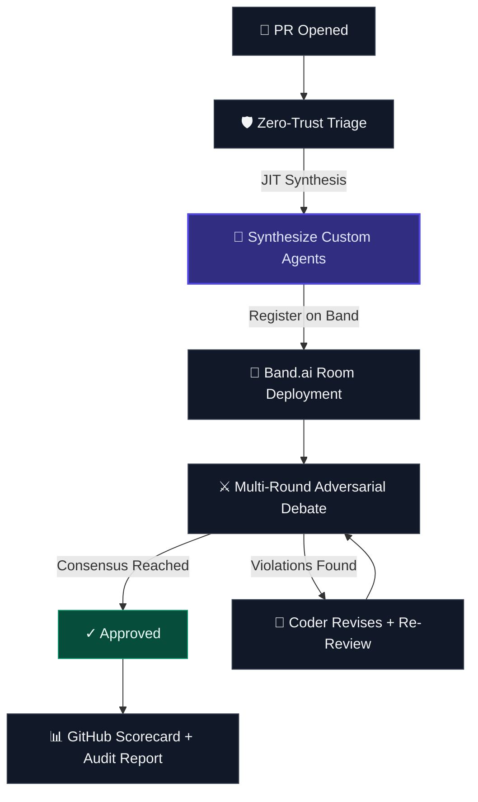
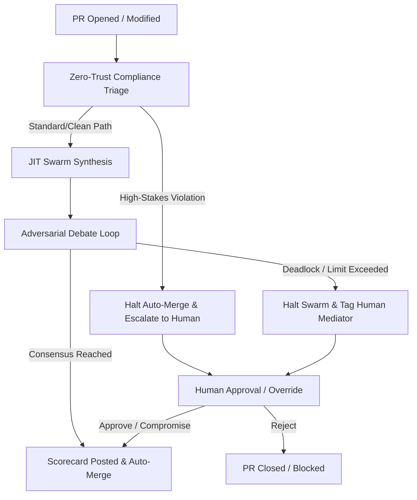

# WellActually.ai 🧠⚡
### Just-in-Time Swarm Intelligence for Code Governance
*Ephemeral, dynamically synthesized AI review agents — orchestrated through **Band.ai's full SDK surface**.*

> Pull Requests don't need static linters. They need an **on-demand governance swarm** — synthesized in real time from the diff itself, debating adversarially, and dissolving when done. That's WellActually.ai.

> **🏆 Track 2: Multi-Agent Software Development** — JIT agent synthesis, cross-model adversarial debate, and autonomous governance.

---

## 🎬 Demo Video

> *Coming soon — demo video will be added before submission.*

---

## 🧠 How It Works



**Phase 1 — Ingest**: Point at any public GitHub repo + PR. System fetches metadata, diff, and file contents.

**Phase 2 — JIT Synthesis** *(The Centerpiece)*: An LLM analyzes the diff to understand *what domains* are affected, then dynamically generates custom reviewer agents — each with a unique persona, domain expertise, and adversarial mandate. A billing PR spawns `Auth & Fraud SME` + `Financial Data Compliance SME`. A chemistry PR spawns `ChemDraw Functionality SME` + `Stereo Parsing Auditor`. No two reviews are the same.

**Phase 3 — Band.ai Deployment**: Agents register on Band.ai, verify identities via `test.authentication`, discover peers, join a task room, and begin coordinating through structured events and context rehydration.

**Phase 4 — Adversarial Debate**: Coder proposes. Reviewers challenge. Messages flow through Band's full lifecycle with `mark_processing → mark_processed/mark_failed` state tracking. Memories persist across rounds. The swarm iterates until consensus is reached or the round limit triggers escalation.

**Phase 5 — Verdict**: Rich scorecard posted as a GitHub PR comment + rendered audit report in the dashboard.

---

## 🔗 Band.ai SDK — Deep Integration (39 Methods)

WellActually.ai uses **39 unique Band SDK methods** across 17 API categories:

| SDK Feature | Methods Used | Purpose |
|---|---|---|
| **System Health** | `get_version()`, `health_check()` | Platform connectivity + service health verification |
| **Auth Verification** | `test.authentication()` | Validate agent credentials post-registration |
| **Human Profile** | `get_my_profile()`, `update_my_profile()` | Verify and synchronize human operator details |
| **Human Peers** | `list_my_peers()` | Discover human operator's connected network |
| **Human Contacts** | `list_my_contacts()` | List human operator contacts |
| **Human Chats** | `list_my_chats()` | List active chat rooms managed by human operator |
| **Human Memories** | `list_user_memories()`, `archive_user_memory()` | Expose listing and archiving of user memories |
| **Human Participants** | `list_my_chat_participants()` | List participants in chat rooms |
| **Human Messages** | `list_my_chat_messages()` | List messages in chat rooms |
| **Agent Registration** | `register_my_agent()`, `list_my_agents()`, `delete_my_agent()` | JIT agent lifecycle — register, enumerate, clean up |
| **Agent Identity** | `get_agent_me()` | Each agent verifies its own identity after registration |
| **Peer Discovery** | `list_agent_peers()` | Discover available agent peers |
| **Agent Contacts** | `add_agent_contact()`, `respond_to_agent_contact_request()`, `list_agent_contacts()` | Peer contact exchange and trust handshake |
| **Chat Rooms** | `create_agent_chat()`, `list_agent_chats()`, `get_agent_chat()` | Room creation, enumeration, metadata verification |
| **Participants** | `add_agent_chat_participant()`, `list_agent_chat_participants()`, `remove_agent_chat_participant()` | Add agents to room, verify roster, clean up on completion |
| **Messages** | `create_agent_chat_message()`, `list_agent_messages()`, `get_agent_next_message()` | Structured communication, audit trail, queue polling |
| **Message Lifecycle** | `mark_agent_message_processing()`, `mark_agent_message_processed()`, `mark_agent_message_failed()` | Full message state tracking with crash recovery |
| **Context Rehydration** | `get_agent_chat_context()` | Agents rehydrate full conversation history from Band before each round |
| **Structured Events** | `create_agent_chat_event()` — `task`, `thought`, `tool_call`, `tool_result`, `error` | Event types used for JIT Swarm governance workflow tracking |
| **Memory — Create** | `create_agent_memory()` | Create violation and success memories |
| **Memory — Read** | `get_agent_memory()`, `list_agent_memories()` | Query previous review context |
| **Memory — Lifecycle** | `supersede_agent_memory()`, `archive_agent_memory()` | Supersede outdated findings, archive on completion |

---

## 🔄 Automated Consensus Flow



---

## 🤝 Platform & Partner Stack

| Platform | Role | How It's Used |
|----------|------|---------------|
| **Band.ai** | Agent Collaboration | Full SDK — 39 methods across identity, peers, rooms, messages, events, memory, participants |
| **AIML API** | Multi-Model Routing | `o3-mini` (high-stakes reasoning), `gpt-4o` (general), `gpt-4o-mini` (fast tasks) |
| **GitHub** | VCS Integration | Live PR loading, diff analysis, scorecard commenting |

---

## 🛠️ Quick Start

```bash
# Clone & configure
git clone https://github.com/vjb/WellActually.ai.git && cd WellActually.ai
cp .env.example .env  # Add: AIML_API_KEY, BAND_API_KEY, GH_TOKEN

# Install
python -m venv .venv && .venv/Scripts/activate && pip install -r requirements.txt
cd frontend && npm install && cd ..

# Run
python -m uvicorn src.server:app --port 8000  # Backend
cd frontend && npm run dev                     # Frontend → http://localhost:5173

# Test
python -m pytest tests/test_swarm.py -v
```

---

## 🔑 Key Differentiators

| Feature | Traditional Tools | WellActually.ai |
|---------|------------------|-----------------|
| Reviewers | Static, pre-configured | **JIT-synthesized** from PR diff |
| Model diversity | Single model | **Multi-LLM** (o3-mini + GPT-4o + GPT-4o-mini) |
| Agent coordination | Direct API calls | **Band.ai rooms** with full lifecycle |
| Governance | Post-merge scanning | **Pre-merge** Zero-Trust gate |
| Agent lifecycle | Persistent | **Ephemeral** — dissolves after review |
| Compliance checks | Generic rules | **Context-aware** — only flags what the PR actually touches |

---

## 👥 Team

Built by **VJ Beltrani** for the [Band of Agents Hackathon](https://lablab.ai/event/band-of-agents-hackathon) (June 12–19, 2026).

## 📜 License

MIT License.
